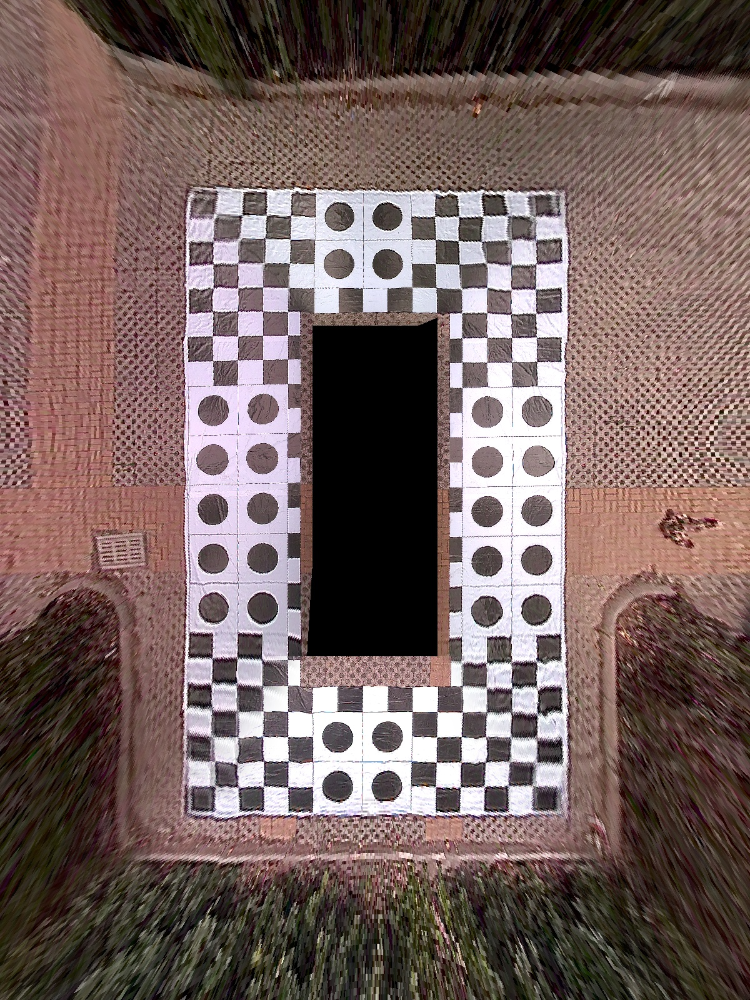
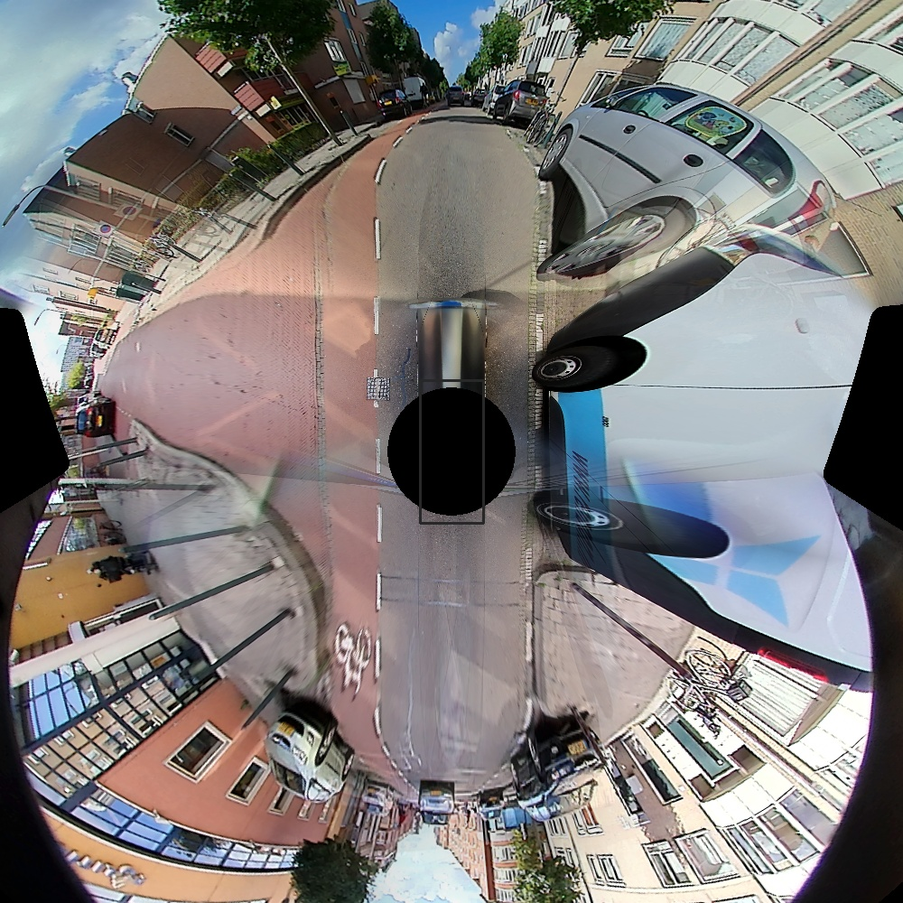

# <h1 align="center">Jetson RTSP 零拷贝视频处理项目</p>

<p align="center">
  <a href="https://bun.com"></a>
</p>

#### <p align = "center"></p>

基于Jetson平台的高性能RTSP流处理项目，实现零拷贝视频处理和CUDA实时加速。

## ✨ 项目特点

- 🚀 **零拷贝架构** - 视频数据始终在GPU显存，无CPU回传（Orin实车模式）
- 🔄 **双模运行** - 支持 **x86仿真** (Sim Mode) 和 **Orin实车** (Real Mode) 无缝切换
- ⚡ **CUDA实时处理** - 支持基于查找表（LUT）的高性能CUDA拼接
- 📡 **RTSP推流** - 支持多客户端同时连接
- 📦 **开箱即用** - 一键跨平台编译

## 📁 项目结构

```
.
├── cpp_demo/           # [核心] C++ 高性能实现版本 (Jetson Orin/x86)
│   ├── src/            # 源代码 (GStreamer + CUDA)
│   ├── scripts/        # 编译运行脚本
│   └── README.md       # C++版本详细文档
├── stitching/          # [算法] Python 2D环视拼接算法原型
│   ├── generate_roecs_lut.py # [NEW] 针对ROECS数据集的LUT生成工具
│   └── generate_data.py      # 通用离线参数生成工具
├── config/             # 配置文件 (roecs.yaml等)
├── ROECS_dataset/      # [新建] 用于仿真的测试数据集
└── README.md           # 项目总览
```

## 🚀 快速开始

本项目包含两个主要部分，请根据需求选择：

### 1. C++ 高性能版本 (推荐)
已实现算法核心与平台适配分离，一套代码兼容开发机与边缘端。

#### x86 开发机 (仿真模式)
```bash
# 1. 生成查找表
cd stitching && python3 generate_roecs_lut.py

# 2. 编译
cd ../cpp_demo && bash scripts/build.sh

# 3. 运行仿真 (循环播放 ROECS 数据集)
./build/rtsp_demo --sim
```

#### Jetson Orin (实车模式)
```bash
# 1. 将项目部署至 Orin (包含生成的 surround_view.binary)
# 2. 编译 (自动识别 Jetson 环境并开启硬件加速)
bash scripts/build.sh

# 3. 运行 (自动开启 4路摄像头采集 + NVMM零拷贝拼接)
./build/rtsp_demo
```

## 📊 性能指标 (ROECS 1000x1000)

| 模式 | 平台 | 耗时 (ms/帧) | 管线架构 | 备注 |
| :--- | :--- | :--- | :--- | :--- |
| **Sim** | RTX 3090 | ~0.5ms (CUDA) | CPU读取 -> H2D -> CUDA -> D2H -> x264 | 仿真验证算法 |
| **Real** | Jetson Orin | **<2ms** (预估) | 4xV4L2 -> NvStreamMux -> **NVMM ZeroCopy** -> CUDA -> NVENC | **生产级高性能** |

## AVM 效果



## 3D AVM 效果示例



###  TODO 
[TODO文档](./docs/todo-brief.md)

## ⚙️ 开发环境

- **硬件**: NVIDIA Jetson Orin / AGX Xavier
- **系统**: Ubuntu 20.04 (JetPack 5.1)
- **依赖**: CUDA, TensorRT, GStreamer, OpenCV

## 📝 License

MIT
