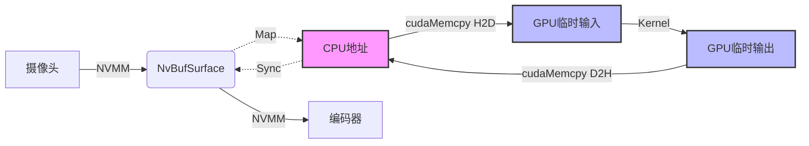
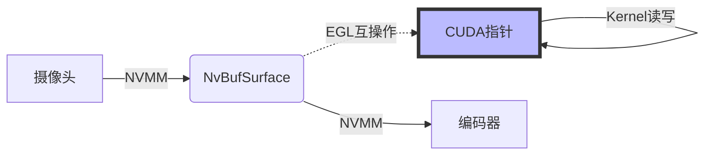

# C++ Demo Project

本项目是环视系统的高性能 C++ 实现版本。

## 📂 项目结构

- `src/`: 源代码
- `scripts/`: 编译和运行脚本
- `docs/`: 详细文档
- `build/`: 编译产物 (编译后生成)

## ✨ 主要特性

- **RTSP Server**: 基于 GStreamer RTSP Server 实现。
- **CUDA Processing**: 自定义 CUDA 核函数实现图像拼接。
- **Hardware Encoding**: 使用 Jetson 硬件编码器 (NVENC)。

## 🚧 当前状态与限制

### 1. 内存管理 (伪零拷贝)
目前项目在 Jetson 上使用 **Host Copy** 方式进行 CUDA 处理：
- **流程**: `NVMM (DMA)` -> `CPU 映射地址` -> `GPU 临时显存` -> `CUDA Kernel` -> `GPU 临时显存` -> `CPU 映射地址` -> `NVMM`。
- **原因**: 在 CUDA 中直接访问 `NVMM` 设备指针 (`dataPtr`) 需要 EGL 互操作，实现较复杂。为了稳定性和兼容性，我们暂时选用了 `mappedAddr` (CPU 指针) + `cudaMemcpy` 方案。
- **影响**: 引入了额外的内存带宽消耗 (~480MB/s @ 1080p 30fps) 和延迟 (~2-4ms)。
- **未来优化**: 实现 `NvBufSurfaceMapEglImage` 以达到真正的零拷贝。

#### 数据流对比

**当前方案: 伪零拷贝 (Host Copy)**


**理想方案: 真零拷贝 (EGL)**


### 2. 性能指标
- **分辨率**: 1920x1080
- **帧率**: 目标 30fps
- **处理耗时**: ~16-18ms / 帧 (包含 H2D/D2H 拷贝和拼接 Kernel)。
- **延迟**: 整体管线延迟满足实时监控要求，但处理阶段消耗了约 50% 的 33ms 帧预算。

## 🚀 使用方法

1. **编译**:
   ```bash
   bash scripts/build.sh
   ```

2. **运行**:
   ```bash
   bash scripts/run.sh
   ```

3. **拉流观看**:
   ```bash
   ffplay rtsp://<JETSON_IP>:8554/live
   ```
