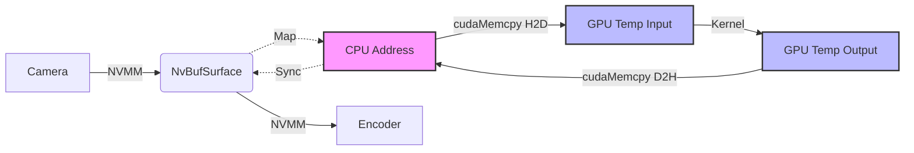
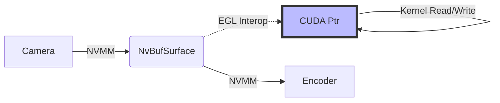

# C++ Demo Project

This directory contains the high-performance C++ implementation of the surround view system.

## Project Structure

- `src/`: Source code
- `scripts/`: Build and run scripts
- `docs/`: Documentation
- `build/`: Build artifacts (created after build)

## Features

- **RTSP Server**: Based on GStreamer RTSP Server.
- **CUDA Processing**: Custom CUDA kernels for image stitching.
- **Hardware Encoding**: Uses Jetson hardware encoder (NVENC).

## Current Status & Limitations

### 1. Memory Management (Pseudo Zero-Copy)
Currently, the project uses a **Host Copy** approach for CUDA processing on Jetson:
- **Flow**: `NVMM (DMA)` -> `CPU Mapped Address` -> `GPU Global Memory` -> `CUDA Kernel` -> `GPU Global Memory` -> `CPU Mapped Address` -> `NVMM`.
- **Reason**: Direct access to `NVMM` device pointers (`dataPtr`) in CUDA requires EGL interoperability, which is complex to implement initially. We opted for `mappedAddr` (CPU pointer) + `cudaMemcpy` for stability and compatibility.
- **Impact**: Introduces extra memory bandwidth consumption (~480MB/s for 1080p@30fps) and latency (~2-4ms).
- **Future Optimization**: Implement `NvBufSurfaceMapEglImage` for true Zero-Copy.

#### Data Flow Comparison

**Current: Pseudo Zero-Copy (Host Copy)**


**Ideal: True Zero-Copy (EGL)**


### 2. Performance
- **Resolution**: 1920x1080
- **Frame Rate**: Target 30fps
- **Processing Time**: ~16-18ms per frame (including H2D/D2H copies and Stitching Kernel).
- **Latency**: Total pipeline latency is acceptable for real-time monitoring, but the processing stage consumes ~50% of the 33ms frame budget.

## Usage

1. **Build**:
   ```bash
   bash scripts/build.sh
   ```

2. **Run**:
   ```bash
   bash scripts/run.sh
   ```

3. **View Stream**:
   ```bash
   ffplay rtsp://<JETSON_IP>:8554/live
   ```
