# C++ Demo Project

本项目是环视系统的高性能 C++ 实现版本。

## 📂 项目结构

- `src/`: 源代码
- `scripts/`: 编译和运行脚本
- `docs/`: 详细文档
- `build/`: 编译产物 (编译后生成)

## ✨ 主要特性

- **RTSP Server**: 基于 GStreamer RTSP Server 实现，支持全硬件加速方案。
- **CUDA BEV Stitching**: 高性能查表法实现，CUDA Kernel 耗时 < 0.5ms。
- **BGR Balancing**: 闭环色彩/亮度对齐算法，消除相邻相机间的视觉跳变。
- **True Zero-Copy**: 基于 `NvBufSurface` 的硬件级内存共享，消除 CPU 拷贝与转换开销。
- **Hardware Encoding**: 使用 Jetson 硬件编码器 (NVENC) 与硬件格式转换器 (VIC)。

## 🚧 当前状态与限制

### 1. 内存管理 (真·零拷贝)
项目在 Jetson 平台上实现了基于 **NvBufSurface** 的全链路硬件加速：
- **流程**: `V4L2 (NVMM)` -> `NvStreamMux` -> `CUDA Kernel (Direct Access)` -> `NVMM Output` -> `NVV4L2H264ENC`。
- **核心**: 核心算法直接在硬件缓冲区的显存物理地址上进行存取，无需 `cudaMemcpy`。
- **优势**: 极大降低了内存带宽占用和 CPU 负载，端到端延迟显著降低。

#### 数据流示意 (True Zero-copy)

```mermaid
graph LR
    CAM[摄像头] -->|NVMM| SURF_IN(NvBufSurface IN)
    SURF_IN -.->|Direct Pointer| CUDA[CUDA Kernel]
    CUDA -.->|Direct Pointer| SURF_OUT(NvBufSurface OUT)
    SURF_OUT -->|NVMM| VIC[VIC 硬件缩放/格式转换]
    VIC -->|NVMM| ENC[NVENC 硬件编码]
    ENC -->|RTP| Network[RTSP 网络推流]

    style CUDA fill:#bbf,stroke:#333,stroke-width:4px
    style VIC fill:#f9f,stroke:#333
    style ENC fill:#f9f,stroke:#333
```


### 2. 性能指标 (Jetson Orin)
- **分辨率**: 1000x1000 BEV Output
- **帧率**: 稳定 30fps
- **处理耗时**: 
  - **CUDA Kernel**: ~0.3ms
  - **端到端延迟 (Capture-to-Stream)**: ~15ms
- **资源占用**: CPU 占用率极低 (< 5%)，内存拷贝开销为 0。

## 🚀 使用方法

1. **编译**:
   ```bash
   bash scripts/build.sh
   ```

2. **运行**:
   ```bash
   bash scripts/run.sh
   ```

3. **拉流观看**:
   ```bash
   ffplay rtsp://<JETSON_IP>:8554/live
   ```
